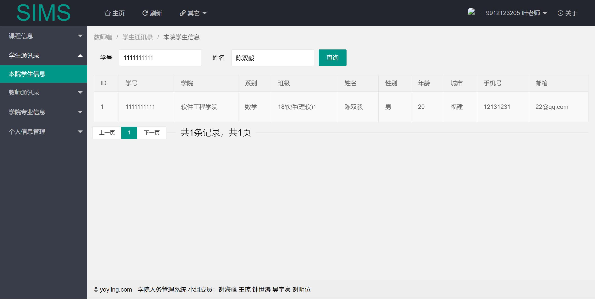
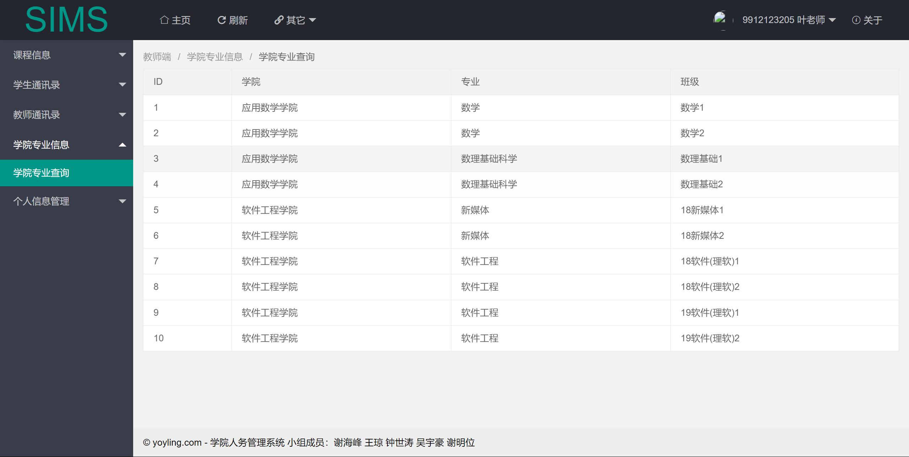
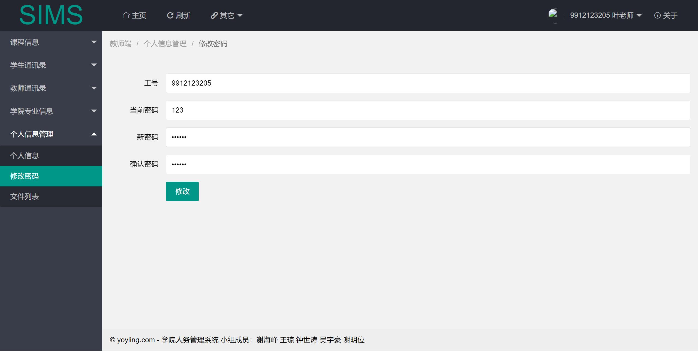
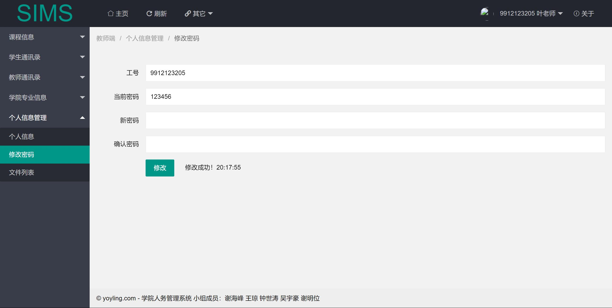
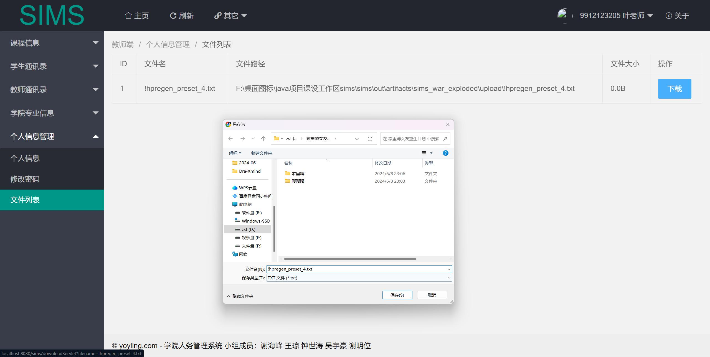
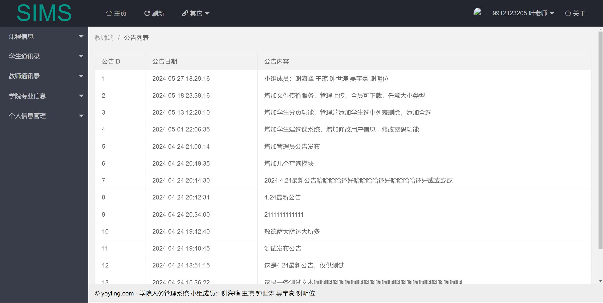

# 此分支用于保存相关截图！
# 各大模块功能测试用例
***************************************************
 
#1.管理员模块
## 1.1 登录页面
输入管理员账号admin，密码admin，

成功登录，显示管理员主页面

## 1.2 学生管理功能
查询功能：查询学号为1111111111，姓名为陈双毅的学生信息，结果如下

修改功能：将陈双毅的系别从软件工程修改为数学，结果如下

成功修改！

增加功能：
增加学号为1111222255，学院为应用数学学院，系别为数学，班级为数学1，姓名为徐欣的学生信息

添加成功！

并能通过查询功能查询到刚添加的信息

删除功能：
删除刚添加的学生信息

通过查询功能，验证成功将该学生信息成功删除

## 1.3 教师管理功能
查询功能：
查询现有所有教师信息

增加功能：增加工号为9912123207，学院为应用数学学院，系别为数学，班级为数学2，姓名为谢宇豪的教师信息

添加成功！

通过查询功能验证刚添加的教师信息

修改功能：将刚添加的教师的班级改为数学1.系别改为数理基础科学

修改成功！

删除功能：将刚刚添加的教师信息删除

通过查询功能验证成功删除

## 1.4 学院专业查询（有bug，只有查没有增删改！）

## 1.5 公告管理
查询功能：查询现有公告

增加功能：发布一条内容为“这是一次公告测试”的公告

发布成功！

删除功能：将刚刚发布的公告删除

通过查询功能验证公告已经成功被删除

## 1.6 文件管理
上传文件功能：上传一个名为“这是一个文件”的txt文件
上传成功！

通过查询功能看到刚上传的文件

下载文件功能：点击下载按钮，文件已经开始下载

删除文件功能：删除刚上传的文件
点击删除按钮，文件已经被成功删除

## 1.7 修改密码
将管理员的密码admin修改成admin1

修改成功！

——————————————————————————————————————————————————
——————————————————————————————————————————————————
——————————————————————————————————————————————————
——————————————————————————————————————————————————
——————————————————————————————————————————————————
 
# 2.老师模块
## 2.1 登录页面
登录账号为9912123205，密码为123、姓名为YNAA的教师账号：

成功登录！

## 3.2 授课信息管理（删除功能bug！）：
查看功能：查看我的授课信息：

增加功能：增加一门课程名为“Java项目管理”的课程

添加成功！

修改功能：点击修改按钮，将课程名“Java项目管理”修改为“Java项目管理2”，修改成功！

删除功能：将将课程名为“Java项目管理”的课程删除
bug故障

## 2.3 查询本院学生信息：查询学号为1111111111，姓名为陈双毅的学生信息，结果如下

## 2.4 查看本院教师信息：

## 2.5 查看学院专业信息：

## 2.6 修改密码功能：将旧密码123修改成新密码123456

修改成功！

## 2.7 文件查看并下载功能：下载名为“!hpregen_preset_4.txt”的文件

## 2.8 查看学校公告：

 
# 3.学生模块
## 3.1 登录页面
登录账号为1111111111、密码为123456、年龄为19，姓名为陈双毅的学生，成功登录！

## 3.2 选课功能：选择课程名为java进阶的课程，成功选课！

## 3.3 查询本院学生信息功能：查询学号为1231231231，姓名为上官怡蓝的学生，成功查询！

## 3.4 查看本院教师信息（只能查，没有增删改的权限！）：

## 3.5 查看学院专业信息（只能查，没有增删改的权限！）：

## 3.6 修改个人信息功能：将姓名为陈双毅的学生的年龄从19修改为20，成功修改！

## 3.7 修改密码功能：将密码从123456修改为123.成功修改！

## 3.8 查看并下载管理员上传的文件：

## 3.9 发布小吐糟：发布一条“这是一条小吐糟”的小吐糟

成功发布！

## 3.10 查看学校公告：

## 3.11 修改个人头像：上传一个名为“16正方体.jpg”的图像并用作个人头像
上传并修改成功！

