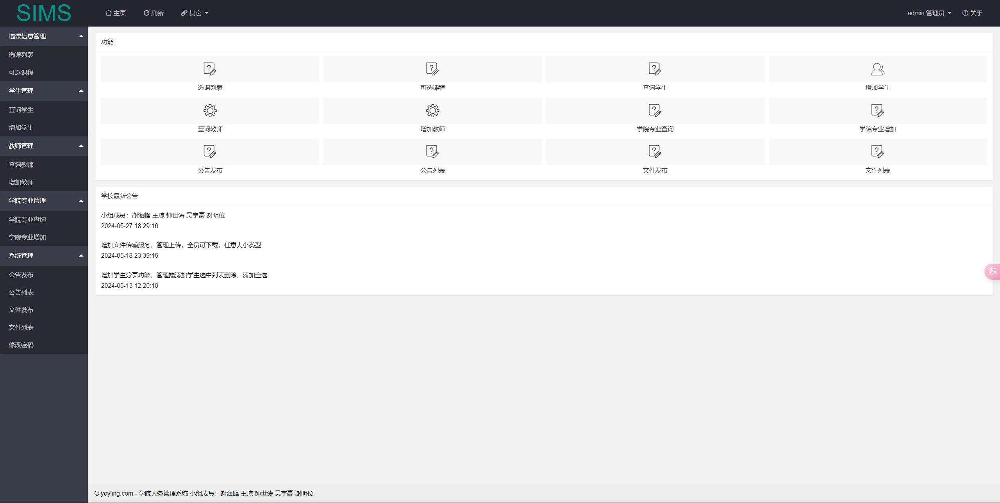
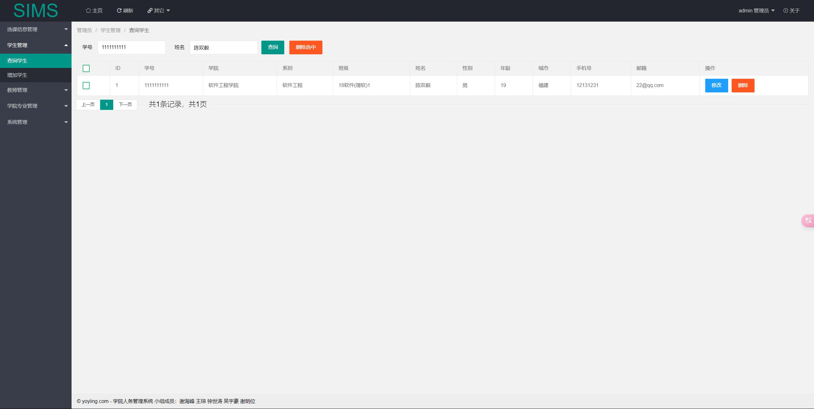
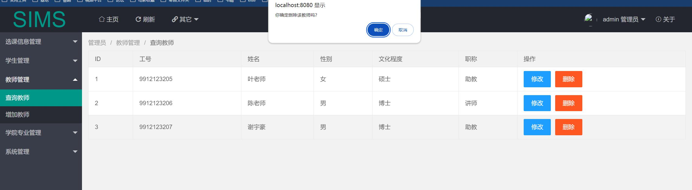
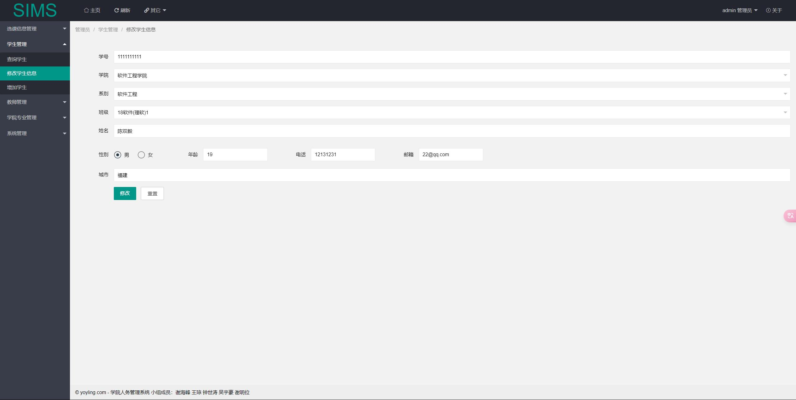

# 学院人务管理系统SIMS
## 改动日志Log
### 24/6.1————丰富页脚个性化信息

### 24/6.1————个性化用户页页脚

### 24/6.1————更改数据库DML语句，个性化公告内容

### 24/6.1————将题目更改为“学院人员信息管理系统”

### 24/6.2————将题目更改为“学院人务管理系统”

## 小组分工项归纳
### 目录：
### 1.管理员模块
#### 1.1 登录页面
#### 1.2 功能
#### 1.3 数据库
#### 1.1 登录页面
#### 1.4 相关代码
——————————————————————————————————————————————————
### 2.老师模块
#### 1.2 功能
#### 1.3 数据库
#### 1.4 相关代码
——————————————————————————————————————————————————
### 3.学生模块
#### 3.1 登录页面
#### 3.2 功能
#### 3.3 数据库
#### 3.4 相关代码
——————————————————————————————————————————————————
### 4.后端逻辑
#### src代码 部分1
#### src代码 部分2
——————————————————————————————————————————————————
### 5.前端页面
#### 前端代码部分
——————————————————————————————————————————————————
### 6.数据库部分
#### 6.1 mysql语句的编写
#### 6.2 数据库的连接
——————————————————————————————————————————————————
### 7.登录注册界面模块
#### 7.1 登录界面
#### 7.2 注册界面
#### 7.3 找回密码
——————————————————————————————————————————————————
### 8.文件上传？？？？
——————————————————————————————————————————————————
### 详细介绍：
### 1.管理员模块
#### 1.1 登录页面

#### 1.2 功能

#### 1.3 数据库

#### 1.4 相关代码

### 2.老师模块
#### 2.1 登录页面

#### 2.2 功能

#### 2.3 数据库

#### 2.4 相关代码

### 3.学生模块
#### 3.1 登录页面

#### 3.2 功能

#### 3.3 数据库

#### 3.4 相关代码

### 4.后端逻辑
#### src代码 部分1

#### src代码 部分2

### 5.前端页面
#### 前端代码部分

### 6.数据库部分
#### 6.1 mysql语句的编写

#### 6.2 数据库的连接

### 7.登录注册界面模块
#### 7.1 登录界面

#### 7.2 注册界面

#### 7.3 找回密码

### 8.文件上传？？？？

tips：如果出现“成功除了努力之外没有其他诀窍”，可能是没有相应的权限访问该界面